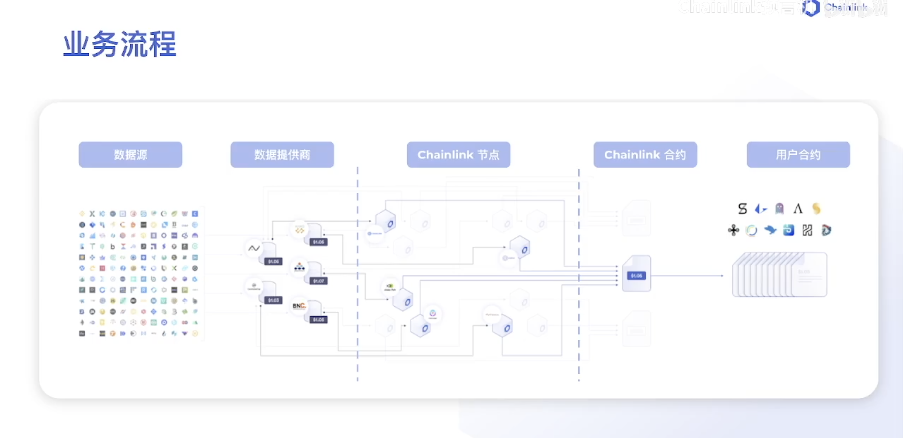

<!--
 * @Descripttion: 
 * @Author: lizhengxing
 * @Date: 2022-11-03 16:30:37
 * @LastEditTime: 2022-11-16 20:56:04
-->
## Data Feed

#### 业务流程

有两个参与方

- 数据提供商：提供数据给预言机节点
- 预言机网络：预言机网络会整合所有的节点，然后将数据发送到部署在链上的合约是



#### 技术架构

- 用户合约
- 代理合约
- 聚合合约


#### 代码实现

```solidity
// SPDX-License-Identifier: MIT
pragma solidity ^0.8.0;

import "@chainlink/contracts/src/v0.8/interfaces/AggregatorV3Interface.sol";

contract DataFeedDemo {
    AggregatorV3Interface public priceFeed;

    constructor() {
        priceFeed = AggregatorV3Interface(0xD4a33860578De61DBAbDc8BFdb98FD742fA7028e);
    }

    function getPrice() public view returns(int256 answer) {
        (,answer,,,) = priceFeed.latestRoundData();
    }
}
```