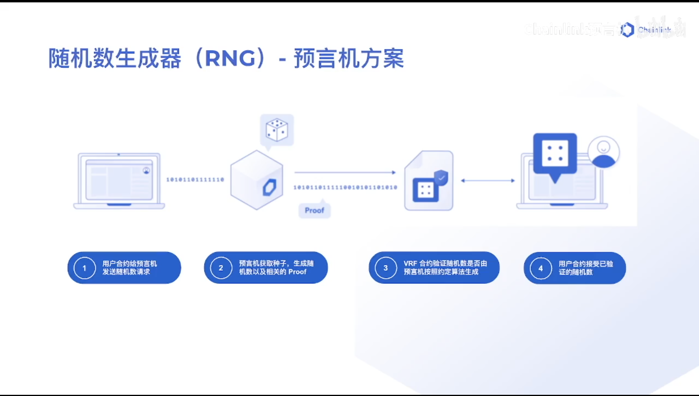
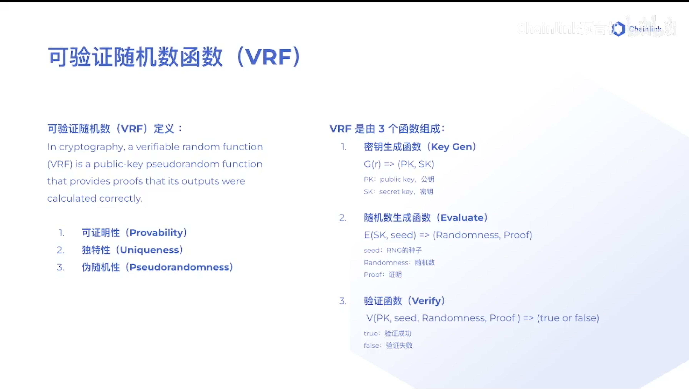
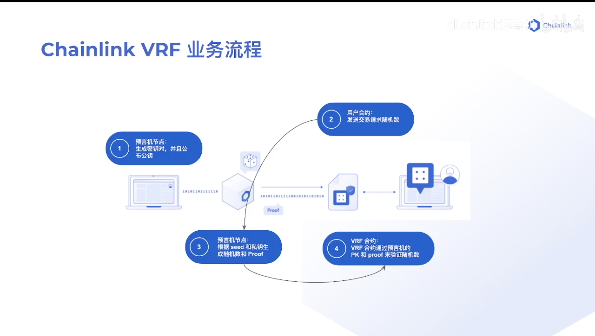
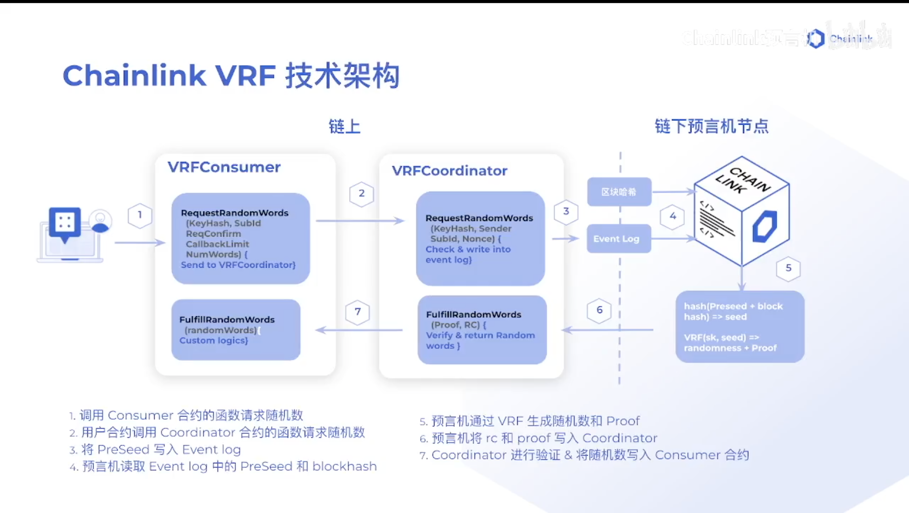

## VRF

#### 随机数生成器（RNG）- 预言机方案

- 1、用户合约给预言机发送随机数请求
- 2、预言机获取链上信息（种子），生成随机数和证明（proof）
- 3、将随机数和种子发送给链上的验证合约，验证随机数是否由预言机按照约定算法生成，并且种子对应链上的区块哈希
- 4、用户合约接收已验证的随机数


#### VRF特点

- 1、可证明性
- 2、独特性：一个种子对应一个输出
- 3、伪随机性：通过数学算法实现

#### 可验证随机数函数

- 1、密钥生成函数；生成公钥和私钥
```
G(r) => (PK, SK)
```
- 2、随机数生成函数：通过私钥和种子生成随机数和证明
```
E(SK, seed) => (Randomness, Proof)
```
- 3、验证函数：使用公钥、种子、随机数、证明进行验证
```
V(PK, seed, Randomness, Proof) => (true or false)
```



#### Chainlink VRF 业务流程

有三个参与方：链下预言机节点（用来生成随机数）、验证合约（验证随机数）、用户合约（请求随机数）

- 1、预言机生成密钥对，将公钥发布到验证合约中
- 2、用户请求随机数
- 3、预言机根据种子和私钥生成随机数和证明（proof）
- 4、验证合约验证随机数，验证成功会发送给用户合约


#### Chainlink VRF 技术架构

- 链上合约
  - VRF用户合约：需要实现两个函数
    - `RequestRandomWords`：请求随机数，调用VRF协作合约里的`RequestRandomWords`函数
    - `FulfillRandomWords`：接收随机数
  - VRF协作合约
    - `RequestRandomWords`：将随机数请求写入到`Event Log` 里面
    - `FulfillRandomWords`：接收预言机随机数和证明，使用公钥和种子进行验证，验证成功，把随机数写入用户`FulfillRandomWords`函数中

- 链下预言机节点
  - 监控`Event Log`，发现有随机数请求，将注册信息和区块哈希作为输入生成一个种子
  - 使用种子和自己的私钥生成随机数和证明
  - 随后将随机数和证明发送到协作合约的`FulfillRandomWords`函数



#### 使用步骤

- 1、[注册VRF订阅](https://vrf.chain.link/)
- 2、将我们的用户合约加入这个订阅
- 3、用户合约请求随机数
- 4、用户合约接收随机数

#### 代码实践

```solidity
// SPDX-License-Identifier: MIT

pragma solidity ^0.8.7;
// 导入vrf需要的文件
// 链上协作合约
import "@chainlink/contracts/src/v0.8/interfaces/VRFCoordinatorV2Interface.sol";
// 链上用户合约
import "@chainlink/contracts/src/v0.8/VRFConsumerBaseV2.sol";

// 为了使协作合约认识我们的合约，需要继承用户合约
contract ChainlinkVRFDemo is VRFConsumerBaseV2 {
    // 使用 Goerli 网络
    // 协作合约
    address vrfCoordinatorAddress = 0x2Ca8E0C643bDe4C2E08ab1fA0da3401AdAD7734D;
    VRFCoordinatorV2Interface COORDINATOR;

    // 请求所需参数
    // bytes32 keyHash - 选择不同的keyHash表示支付不同的gas price，数额越大
    bytes32 keyHash = 0x79d3d8832d904592c0bf9818b621522c988bb8b0c05cdc3b15aea1b6e8db0c15;
    // uint64 subId - 创建的订阅id
    uint64 subId;
    // uint16 requestConfirmations - 多少个区块以后交易成功
    uint16 requestConfirmations = 3;
    // uint32 callbackGasLimit - 返回随机数的操作上限
    uint32 callbackGasLimit = 200_000;
    // uint32 numWords - 请求的随机数数量，上限500
    uint32 numWords = 3;

    // 请求返回值 - requestId
    // 36479525829242911606468998032995716075769171384512504964069400995378943935617
    uint256 public requestId;

    // 接收到的随机数
    // 0 - 8362574271720175643459089685658571503384978340955876519970596689425355722253
    // 1 - 50689303937544287535356788511902101331701017070377382926268342732321744801769
    // 3 - 56363568810167419818890106014893836346696115064244701328522240984379672390386
    uint256[] public randomWords;

    // owner
    address owner;

    // 继承的用户合约需要协作合约地址
    constructor(uint64 subId_) VRFConsumerBaseV2(vrfCoordinatorAddress) {
        COORDINATOR = VRFCoordinatorV2Interface(vrfCoordinatorAddress);
        subId = subId_;
        owner = msg.sender;
    }

    // 请求随机数
    function requestRandomWords() external {
        require(msg.sender == owner, "Not owner!");
        // 调用协作合约的 requestRandomWords 方法
        requestId = COORDINATOR.requestRandomWords(
            keyHash,
            subId,
            requestConfirmations,
            callbackGasLimit,
            numWords
        );
    }
    
    // 接收随机数
    function fulfillRandomWords(uint256 requestId, uint256[] memory randomWords_) internal override {
        randomWords = randomWords_;
    }
}
```