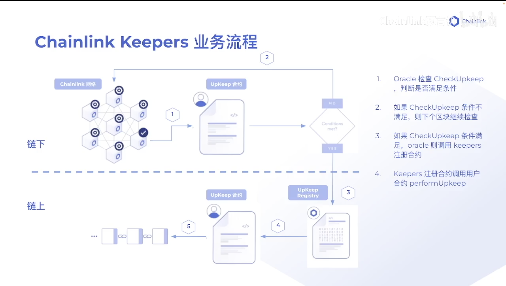
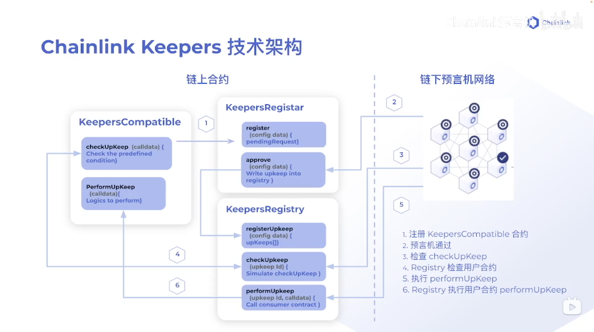

<!--
 * @Descripttion: 
 * @Author: lizhengxing
 * @Date: 2022-11-03 16:29:58
 * @LastEditTime: 2022-11-03 18:10:36
-->
## Keeper

合约的自动化执行

#### 业务流程

有三个参与方：用户合约（`UpKeep`）、`chainlink`注册合约（`UpkeepRegistry`）、链下预言机网络

- 1、用户将自己的`UpKeep`合约注册到`chainlink`的`UpkeepRegistry`合约中
- 2、预言机网络在每个区块中检查`UpKeep`合约条件是否被满足
- 3、如果不满足，继续在下个区块检查
- 4、如果满足，会调用`UpkeepRegistry`合约，`UpkeepRegistry`合约会调用`UpKeep`合约



#### 技术架构

需要用到三个合约：

- 用户自己的合约 - `KeepersCompatible`
  - `checkUpkeep`: 判断`performUpkeep`函数要执行的条件
  - `performUpkeep`: 需要被执行的逻辑

- `KeeperRegistar`合约
  - `register` - 用户调用这个函数注册用户合约
  - `approve` - 预言机通过会调用`registerUpKeeper`函数
  
- `KeeperRegistry`合约
  - `registerUpKeeper` - 这个函数注册用户合约
  - `checkUpkeep`: 调用用户合约同名函数，在每个区块进行判断
  - `performUpkeep`: 满足条件，调用这个函数，进而调用用户合约同名函数

**执行`checkUpkeep`函数不需要花费`Gas`，因为是在链下执行，所以可以把一些复杂的操作写在`checkUpkeep`函数中节省`Gas`**



#### 使用步骤

- 1、[注册UpKeep](https://keepers.chain.link/)
- 2、选择`custom logic`
- 3、将我们的用户合约地址填入
- 4、用户改变数据，使条件生效
- 5、`UpKeep`监听到变化，执行`performUpkeep`逻辑

#### 代码实践

```solidity
// SPDX-License-Identifier: MIT

pragma solidity ^0.8.0;

// 用户合约
import "@chainlink/contracts/src/v0.8/interfaces/KeeperCompatibleInterface.sol";

// 本合约需要继承自用户合约
contract KeeperDemo is KeeperCompatibleInterface {
    // 数组长度
    uint256 public constant SIZE = 100;
    // 数组每个元素的初始值
    uint256 public constant INITIAL_BALANCE = 1000;
    // 数组
    uint256[SIZE] public balances;

    constructor() {
        // 给数组赋值
        for (uint256 i = 0; i < SIZE; ++i) {
            balances[i] = INITIAL_BALANCE;
        }
    }

    // 改变数组
    function widthdraw(uint256 amount, uint256[] memory indexs) public {
        uint256 len = indexs.length;
        for (uint256 i = 0; i < len; ++i) {
            balances[indexs[i]] -= amount;
        }
    }

    // 检查条件函数
    function checkUpkeep(bytes calldata checkData)
        external
        override
        returns (bool upkeepNeeded, bytes memory performData)
    {
        upkeepNeeded = false;
        // 检查条件 - 只要有一个数不是初始值，检查通过
        for (uint256 i = 0; i < SIZE  && !upkeepNeeded; ++i) {
            if(balances[i] < INITIAL_BALANCE) {
                upkeepNeeded = true;
            }
        }
        return (upkeepNeeded, "");

    }

    // 检查通过执行的逻辑
    function performUpkeep(bytes calldata performData) external override {
        // 检查通过，将数组所有的值都置为初始值
        for (uint256 i = 0; i < SIZE; ++i) {
            if(balances[i] < INITIAL_BALANCE) {
                balances[i] = INITIAL_BALANCE;
            }
        }
    }
}

```